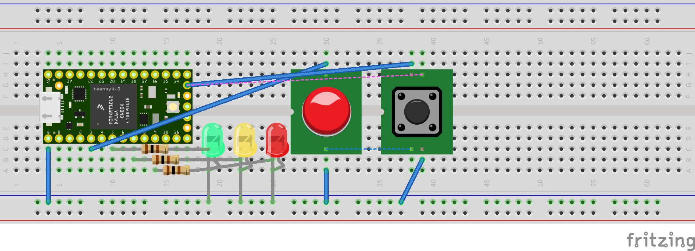
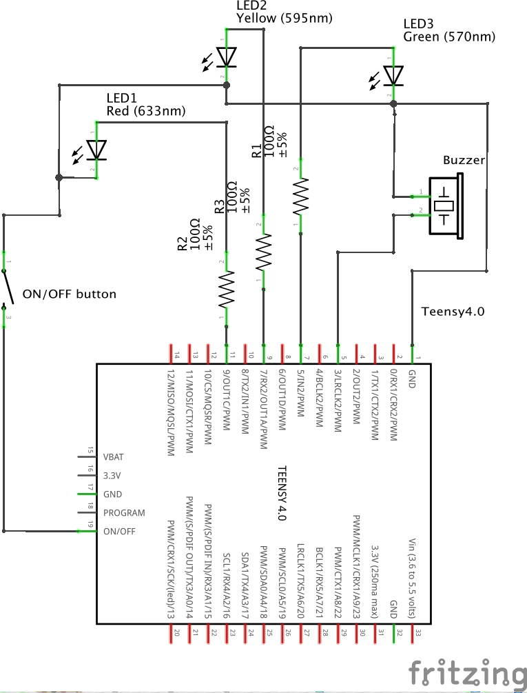
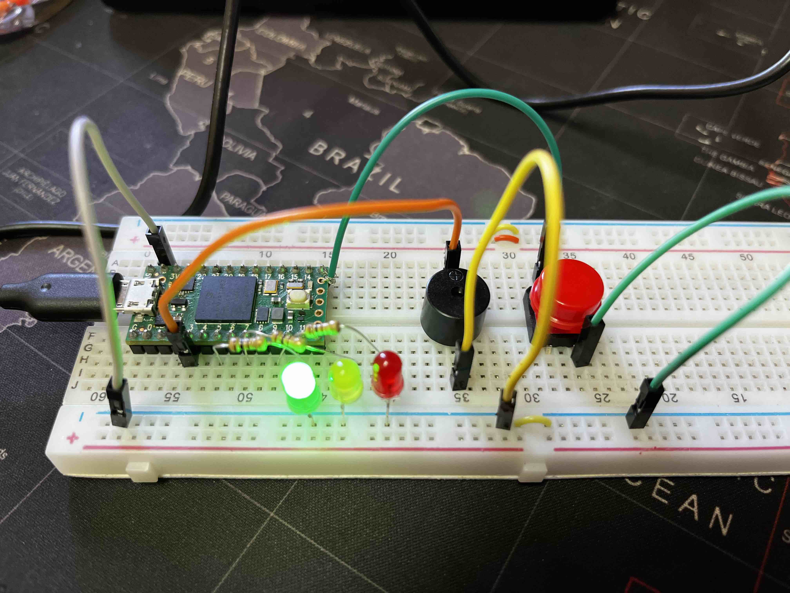

# miniTimeControl

Small project for control time in presentations based on CircuitPython.

There are two calls during the presentation. The first call of attention (yellow led) and the final call of attention (red led) when presentation time ends.

There is a delay (configurable) beferore each. 

The routine is simple:

 - Blink leds
 - Keep green led on and buzzer sounds
 - Blink green and yellow less `delay` seconds before first call
 - Keep yellow led on and buzzer sounds for 1 seconds
 - Blink yellow and red less `delay` seconds before final call
 - Keep red led on and buzzer sounds for 2 seconds

## Wiring

Wiring is simple, just connect resistances to leds, buzzer to a PWM pin and button to ON/OFF pin (valid for Teensy4.0).

Since Teensy's digital output is 3.3V, I used a 100 Ohm resistor for each led.

## Schematics

## Prototype

Photo of prototype using Teensy 4.0:

